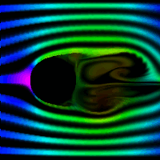

# Eulerian Fluid Simulation

An Eulerian fluid simulation written in Rust, loosely following Matthias Muller's tutorial.

## Controls

- Run using Cargo: `cargo run --release`
- Cycle through visualization modes (various color options; pressure, speed, smoke trails) with the arrow keys. Click/drag to place additional obstacles. Press SPACE to restart the simulation, and press C to clear your placed obstacles.

## Technical Implementation

The fluid medium is treated as a discretized 2D vector field of velocities. The field is stored as a grid of "cells", containing pressure/smoke information, with each cell edge having an associated flux. Each step:

- fluid incompressibility is enforced by making the divergence (flux out minus flux in) of each cell zero (projection). This has the added effect of allowing the simulation to populate each cell with a pressure value (every time fluid flows in, increase pressure. Every time fluid flows out, decrease it).
- Gravity is optionally applied, followed by
- an "advection" step. In this step, the vector field is, essentially, moved along itself. Each vector velocity "looks backwards", sampling the vector velocity at the point V \* dt in its reverse direction. Since this point will rarely fall on the exact center (edge due to MAC coordinates) of another vector, the vectors around it are linearly interpolated to arrive at a final value.
  While this is more roundabout than the more straightforward solution of going through each vector in the grid, finding where it's going to move to (as opposed to where it has moved from as we are doing here), and copying its value there, the non-naive solution has several advantages:

- One write per vector: each cell is accessed once, and is guaranteed to be updated each step. This is not the case in the naive approach, where different cells of fluid flowing into the same one could conflict and overwrite each other. This should technically allow for some degree of parallelization.
- Update control: by having direct control over which cell velocities are being updated, configurations like wind tunnels, pressure chambers and others where it is useful to be able to keep cell velocities fixed are easier to implement.

In propagating velocities by looking backwards instead of looking forwards, we make the assumption that the velocity field is continuous, and that the lookbehind distance is negligible relative to the cell size. Each step, we are implicitly assuming that the direction and amount of fluid flowing into a point in the field is the same as that of flowing out of the point, and since the points are not infinitely dense, this introduces some degree of viscosity to the simulation.

## Sources/inspiration

https://youtu.be/iKAVRgIrUOU?si=Oc8n5BHoWxqfJEbp
